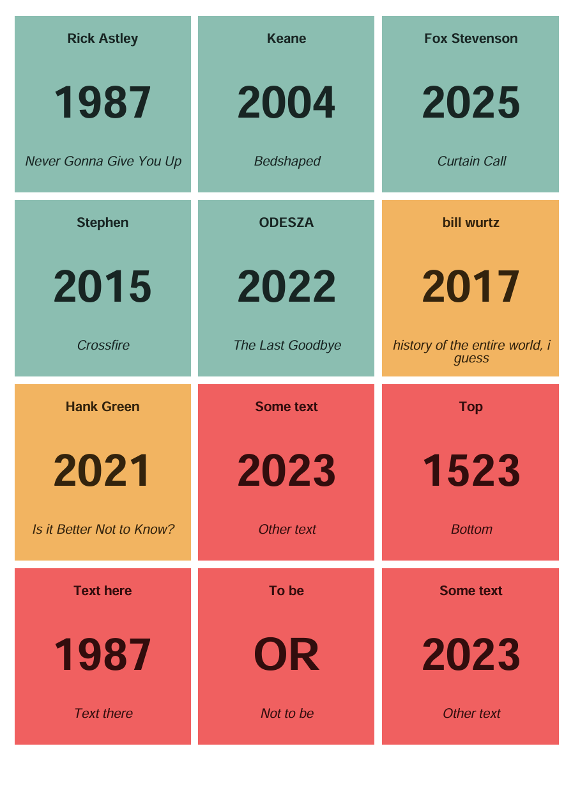
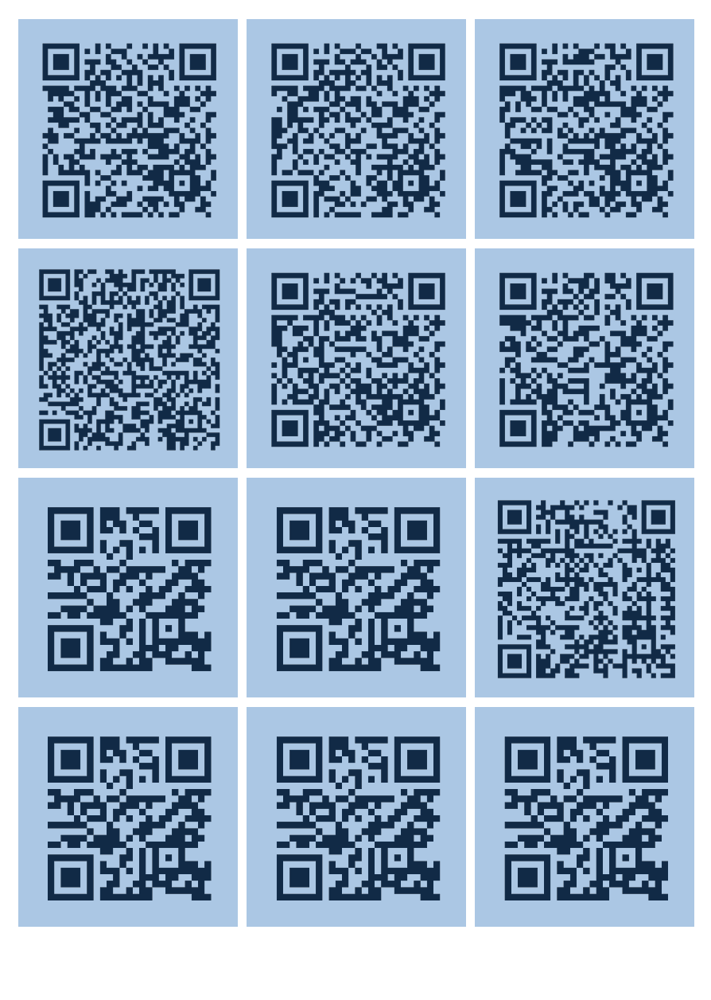

# Hitster Card Creator

This project allows you to create printable cards and tokens for a game similar to the music guessing game **Hitster**. The generated PDF contains double-sided cards that can be printed, cut out, and used for gameplay.

If anything is unclear, please feel free to [open an issue](https://github.com/WesselvanDam/hitster-card-generator/issues) or [contact me](mailto:wessel@wesselvandam.com) directly. I will do my best to help you out!

## Features

- Both a Python script for those who want to tweak the behaviour, and a [https://wesselvandam.github.io/hitster-card-generator](webpage) for those who want a no-code solution that works right out of the box.
- Generate a PDF with cards based on data from a CSV file.
- Cards can represent various types of content, such as songs, videos, articles, or paintings. Don't limit yourself to just music! I made this project to create a Hitster-like game with some music, but also a lot of photos which one had to put in the right order.
- Customizable card and page configurations, including colors and sizes.
- Includes printable tokens for gameplay.

## Example

If you have a CSV file with the following content:

| type    | url                                                                                                                                 | top           | bottom                               | center |
| ------- | ----------------------------------------------------------------------------------------------------------------------------------- | ------------- | ------------------------------------ | ------ |
| song    | [{long url}](https://open.spotify.com/track/4PTG3Z6ehGkBFwjybzWkR8?si=f51ee06bce0e4a94)                                             | Rick Astley   | Never Gonna Give You Up              | 1987   |
| song    | [{long url}](https://open.spotify.com/track/17xGX76BVzLRSbpYteAGR4?si=86f7c45002f74cd2)                                             | Keane         | Bedshaped                            | 2004   |
| song    | [{long url}](https://open.spotify.com/track/5sT0sdrMmM4L4ZdBiv4Q2Z?si=78f89c69b69a4410)                                             | Fox Stevenson | Curtain Call                         | 2025   |
| song    | [{long url}](https://open.spotify.com/track/5HjBpej4uHPAX8sMeUFJms?si=8ef2aeff255f475b)                                             | Stephen       | Crossfire                            | 2015   |
| song    | [{long url}](https://open.spotify.com/track/2gQK13gXYZRq2MgvPJyHx8?si=bbbd9f31922143da)                                             | ODESZA        | The Last Goodbye                     | 2022   |
| video   | [{long url}](https://www.youtube.com/watch?v=xuCn8ux2gbs&pp=ygUjaGlzdG9yeSBvZiB0aGUgZW50aXJlIHdvcmxkIGkgZ3Vlc3PSBwkJhgkBhyohjO8%3D) | bill wurtz    | history of the entire world, i guess | 2017   |
| video   | [{long url}](https://www.youtube.com/watch?v=2PF5AAEAWTs&pp=ygUkd291bGQgeW91IHJhdGhlciBub3Qga25vdyBoYW5rIGdyZWVu)                   | Hank Green    | Is it Better Not to Know?            | 2021   |
| article | [{long url}](https://www.google.com/)                                                                                               | Some text     | Other text                           | 2023   |
| article | [{long url}](https://www.google.com/)                                                                                               | Top           | Bottom                               | 1523   |
| article | [{long url}](https://www.google.com/)                                                                                               | Text here     | Text there                           | 1987   |
| article | [{long url}](https://www.google.com/)                                                                                               | To be         | Not to be                            | OR     |
| article | [{long url}](https://www.google.com/)                                                                                               | Some text     | Other text                           | 2023   |

It will generate a PDF with cards like the following:

<div style="display: flex; justify-content: center; gap: 20px;">
  
  
</div>

Note that the QR code on the top right corner of the page on the right corresponds to the card in the top left corner of the page on the left. This is because the cards are to be printed double-sided, and this way the QR codes will be aligned correctly.

## Getting Started

Visit the [https://wesselvandam.github.io/hitster-card-generator](webpage version) if you just want to upload your CSV and get the PDF.

### Tailwind CSS v4 (CLI)

The website uses Tailwind CSS v4 built with the Tailwind CLI. Configuration is done via CSS directives in `src/input.css` (not JavaScript). The compiled CSS is committed to `assets/tailwind.css` so GitHub Pages can serve it.

1. Install the CLI dependencies:
   ```bash
   npm install
   ```
2. Build the CSS once:
   ```bash
   npm run build:css
   ```
3. Or run in watch mode while editing:
   ```bash
   npm run watch:css
   ```

The Tailwind configuration uses CSS directives in `src/input.css`:

- `@theme` — Custom design tokens (colors, fonts, border radius)
- `@source` — Content file detection
- `@plugin` — Tailwind plugins (@tailwindcss/forms, @tailwindcss/typography)

Otherwise, you can use the Python version located in the `src` directory. If you are not familiar with Python or Git, you might want to check out [this Google Colab notebook](https://colab.research.google.com/drive/1wJosGkdxvzGYWLykdSODbbToHJt-_Z4P?usp=sharing) that provides a step-by-step guide to generating your own cards and tokens. The notebook includes instructions on how to upload your CSV file and run the code without needing to install anything on your local machine.

If you prefer to run the code locally, follow the instructions below.

### Prerequisites

To use this project, you need:

- Python 3.10 or higher installed on your system.
- Basic knowledge of running Python scripts (no prior experience with Git or Python is required).

### Installation

1. Download or clone this repository to your computer.
2. Open a terminal or command prompt and navigate to the project folder.
3. Create a virtual environment (optional but recommended):
   ```bash
   python -m venv env
   ```
4. Activate the virtual environment (skip this step if you didn't create one):
   - On Windows:
     ```bash
     .\env\Scripts\Activate.ps1
     ```
   - On macOS/Linux:
     ```bash
     source env/bin/activate
     ```
5. Install the required dependencies:
   ```bash
   pip install -r requirements.txt
   ```

### Usage

1. **Prepare Your Data**
   - Place your data in a CSV file inside the `data` folder.
   - The CSV file should follow the format of the provided example file `data/data.csv`:
     ```csv
     type;url;top;bottom;center
     song;https://example.com;Artist Name;Song Title;Year
     video;https://example.com;Creator Name;Video Title;Year
     article;https://example.com;Headline;Subheadline;Year
     painting;https://example.com;Artist Name;Painting Title;Year
     ```
   - The `type` column determines the type of card (e.g., `song`, `video`, `article`, `painting`).
   - The `url` column contains the URL for the QR code. This can be any valid URL, such as a Spotify link, YouTube link, or a webpage link. For example, I used Google Drive links to images that I had uploaded to my Google Drive. Please ensure that the links are publicly accessible and long-lived, so that your cards will work for a long time.
   - The `top`, `bottom`, and `center` columns contain the text that will be displayed on the front side of the card. The `top` and `bottom` columns are used for the top and bottom text, while the `center` column is used for the center text (typically a year). You can use any text you like, but make sure to keep it short enough to fit on the card.

2. **Customize Configuration**
   - Open the `src/config.py` file to adjust settings such as:
     - Page and card sizes.
     - Colors for the front and back sides of the cards. The front side can be customized based on the type of card. Colors are given in RGB format (0-255).
   - Note: Not all sizes are possible to ensure proper alignment for double-sided printing.

3. **Generate the PDF**
   - Run the script to create the PDF:
     ```bash
     python src/pdf.py
     ```
   - The generated PDF will be saved in the `outputs` folder as `output.pdf`.

4. **Print the Cards and Tokens**
   - Use thick paper (e.g., 300 grams) for printing.
   - Print the PDF double-sided to ensure proper alignment of the card fronts and backs.
   - Cut out the cards and tokens for gameplay.

## Additional Information

- The back sides of all cards are identical to prevent players from identifying the card type before flipping it.
- Tokens are included in the PDF and are made using the `assets/token.png` image.


## Contributing

Feel free to fork this repository and make improvements. Pull requests are welcome!

## License

This project is licensed under the MIT License. See the LICENSE file for details.

---

Enjoy creating your own custom cards and tokens for a fun and engaging game experience!
